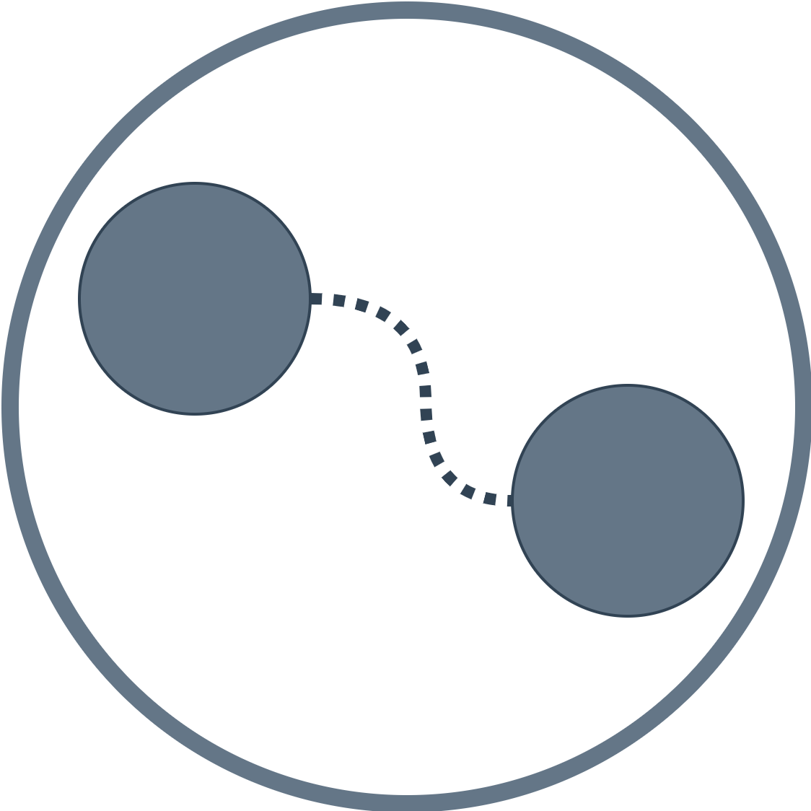
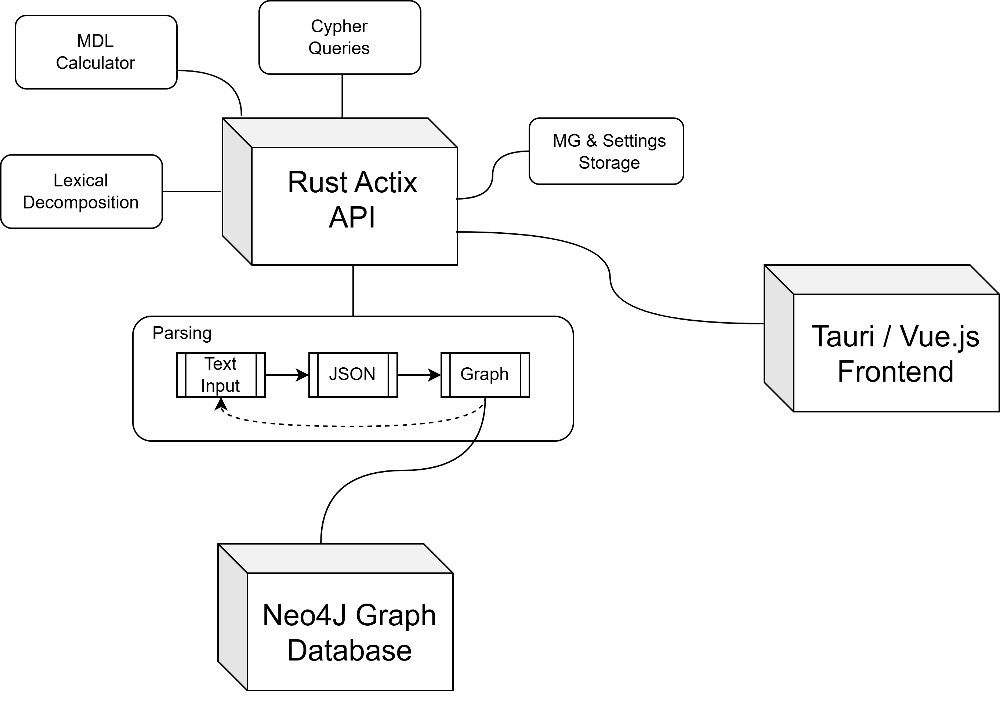

<!-- Improved compatibility of back to top link: See: https://github.com/othneildrew/Best-README-Template/pull/73 -->
<a id="readme-top"></a>
<!--
*** Thanks for checking out the Best-README-Template. If you have a suggestion
*** that would make this better, please fork the repo and create a pull request
*** or simply open an issue with the tag "enhancement".
*** Don't forget to give the project a star!
*** Thanks again! Now go create something AMAZING! :D
-->


<!-- PROJECT SHIELDS -->
<!--
*** I'm using markdown "reference style" links for readability.
*** Reference links are enclosed in brackets [ ] instead of parentheses ( ).
*** See the bottom of this document for the declaration of the reference variables
*** for contributors-url, forks-url, etc. This is an optional, concise syntax you may use.
*** https://www.markdownguide.org/basic-syntax/#reference-style-links
-->
[![LinkedIn][linkedin-shield]][linkedin-url]
[![Rust][Rust]][Rust-url]
[![TypeScript][TypeScript]][Typescript-url]
[![Vue.js][Vue.js]][Vue-url]
[![Tauri][Tauri]][Tauri-url]
[![Neo4J][Neo4J]][Neo4J-url]


<!-- PROJECT LOGO -->
<br />
<div align="center">
    

  <h3 align="center">MG-Graph Desktop</h3>

  <p align="center">
    An open-source cross-platform application for the exploration and analysis of Minimalist Grammars (MGs)
    <br />
    <!-- <a href="https://github.com/othneildrew/Best-README-Template"><strong>Explore the docs »</strong></a> -->
    <br />
    <br />
    <a href="">View Demo</a>
    &middot;
    <a href="https://github.com/DanielGall500/MG-Graph/issues/new?labels=bug&template=bug-report---.md">Report Bug</a>
    &middot;
    <a href="https://github.com/DanielGall500/MG-Graph/issues/new?labels=enhancement&template=feature-request---.md">Request Feature</a>
  </p>
</div>

<!-- ABOUT THE PROJECT -->
## About The Project



MG-Graph is a cross-platform application designed for researchers in theoretical linguistics. It allows you to model, visualise, and analyse Minimalist Grammars in a graph-based format. Built for portability and accessibility, it helps bridge theoretical syntax with computational tools, supporting research into syntactic structure and linguistic abstraction.

## Use Cases
* Providing a unified, **interactive interface** for working with MGs.
* Using **description length minimisation** as a metric for theoretical optimality and generalisation.
* Enabling structured storage, querying, and analysis of MGs via **graph-based representations**.

## 🧰 Features
* **Graph-based MG modelling and storage** using Neo4j
* **Grammar size calculation** using information-theoretic metrics
* **Shortest path exploration** through feature graphs
* **Human-in-the-loop lexical decomposition**
* **Multigraph visualisations** of syntactic structure
* **Cross-platform** support via Tauri (Windows, macOS, Linux)

<p align="right">(<a href="#readme-top">back to top</a>)</p>

### Built With
This project aimed to model MGs using a graph database given how they naturally lend themselves to this type of representation.
An Actix backend API was implemented with Rust which communicates with the Vue.js / Tauri frontend.
* [![Rust][Rust]][Rust-url]
* [![TypeScript][TypeScript]][TypeScript-url]
* [![Vue.js][Vue.js]][Vue-url]
* [![Tauri][Tauri]][Tauri-url]
* [![Neo4J][Neo4J]][Neo4J-url]

<!-- CONTRIBUTING -->
## Contributing

Contributions are what make the open source community such an amazing place to learn, inspire, and create. Any contributions you make are **greatly appreciated**.

If you have a suggestion that would make this better, please fork the repo and create a pull request. You can also simply open an issue with the tag "enhancement".
Don't forget to give the project a star! Thanks again!

1. Fork the Project
2. Create your Feature Branch (`git checkout -b feature/AmazingFeature`)
3. Commit your Changes (`git commit -m 'Add some AmazingFeature'`)
4. Push to the Branch (`git push origin feature/AmazingFeature`)
5. Open a Pull Request

## 🧱 System Requirements

* **Neo4j Community Edition** (required to store and query grammars)

  * Download: [https://neo4j.com/download/](https://neo4j.com/download/)
* **Rust** (for backend execution)
* **Node.js** (for frontend UI)

---

## 🚀 Installation & Setup

1. **Install Neo4j Community Edition**

   * Launch Neo4j and create a new database.
   * Take note of your *host*, *port*, *username*, and *password*.

2. **Clone and build the MG Insight Toolkit**

   ```bash
   git clone https://github.com/DanielGall500/MG-Graph.git
   cd MG-Graph
   ```

4. **Start the frontend (Tauri & Vue.js)**

   ```bash
   cargo tauri dev
   ```

5. **Configure database access** in the app settings:

   * Input your Neo4j connection credentials and test the connection.

---

## 📊 Example Use Cases

* Compare competing theoretical analyses for a syntactic phenomenon
* Visualise derivational structure and movement paths
* Estimate the complexity of a grammar via size metrics
* Explore lexical item reuse and over-/under-generation patterns


<!-- MARKDOWN LINKS & IMAGES -->
<!-- https://www.markdownguide.org/basic-syntax/#reference-style-links -->
[issues-shield]: https://img.shields.io/github/issues/othneildrew/Best-README-Template.svg?style=for-the-badge
[issues-url]: https://github.com/othneildrew/Best-README-Template/issues
[license-shield]: https://img.shields.io/github/license/othneildrew/Best-README-Template.svg?style=for-the-badge
[license-url]: https://github.com/othneildrew/Best-README-Template/blob/master/LICENSE.txt
[linkedin-shield]: https://img.shields.io/badge/-LinkedIn-black.svg?style=for-the-badge&logo=linkedin&colorB=555
[linkedin-url]: https://www.linkedin.com/in/daniel-gallagher-a520161a3/
[product-screenshot]: images/screenshot.png

[Vue.js]: https://img.shields.io/badge/-Vue.js-4fc08d?style=flat&logo=vuedotjs&logoColor=white
[Vue-url]: https://vuejs.org/

[Rust]: https://img.shields.io/badge/Rust-000000?logo=rust&logoColor=white
[Rust-url]: https://www.rust-lang.org/

[Tauri]: https://img.shields.io/badge/Tauri-24C8D8?logo=tauri&logoColor=fff
[Tauri-url]: https://v2.tauri.app

[TypeScript]: https://shields.io/badge/TypeScript-3178C6?logo=TypeScript&logoColor=FFF&style=flat-square
[TypeScript-url]: https://www.typescriptlang.org/

[Neo4J]: https://img.shields.io/badge/Neo4j-008CC1?logo=neo4j&logoColor=white
[Neo4J-url]: [https://laravel.com](https://neo4j.com/)

---

For questions or academic collaboration inquiries, please contact the maintainer via the GitHub repository.
